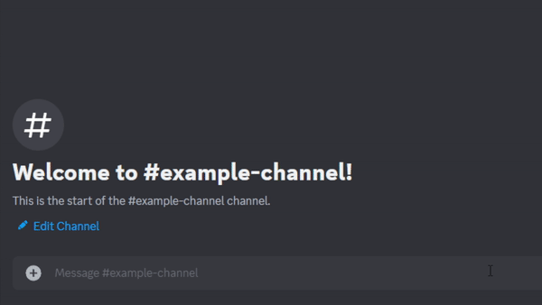

# Donimo, a CTA Rail Bot

Domino helps give arrival times for all CTA stations through discord's slash commands and interactions.

### Usage

Using `/train` you will be able to select a [CTA Line](https://en.wikipedia.org/wiki/List_of_Chicago_%22L%22_stations) by their color. 
Depending the the line, you may be further asked what branch you are on `e.g. Red Line: North Side Main Line, State Street Subway, Dan Ryan Branch`. This is due to [Discord's limit](https://discordpy.readthedocs.io/en/stable/interactions/api.html#discord.ui.Select.add_option) on select options for its interation.

After the previous selection, the user will get to choose what station they would want to look at arrival times for. The message will be formatted as follows:
```
Station name
Displaying *Selected Line* arrival times
Service towards *North and South bound destinations*
Arrival Times for each service (📶 properly tracked by CTA, 🕒 based by schedule from CTA)
```
#### Example of usage


### How to run
To self-host this bot, you would need a [Discord Bot Token](https://discord.com/developers/applications) and a [CTA Train Tracker API Token](https://www.transitchicago.com/developers/traintracker/) respectively. 

You will then include these keys in the `.env` as:

```
DISCORD_TOKEN=YOUR_DISCORD_BOT_TOKEN_HERE
CTA_TRAIN_TOKEN=YOUR_CTA_TRAIN_TRACKER_TOKEN_HERE
```

Run `python3 bot.py` and your bot should be running! Test using `/train` in a discord chat.